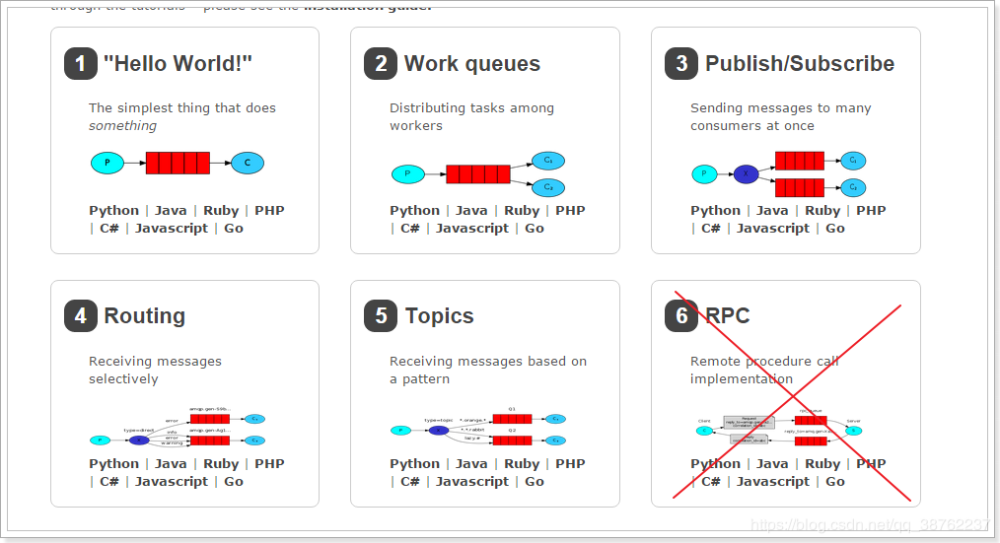

# SpringBoot整合RabbitMQ实现五种消息模型

> 说明：开始本项目请提前安装好RabbitMQ，Erlang语言

相关软件的安装

[Erlang下载地址](https://www.erlang.org/downloads)

[Erlang下载地址](https://www.rabbitmq.com/download.html)

[RabbitMQ五种消息模型介绍](https://blog.csdn.net/qq_38762237/article/details/89416444)


RabbitMQ提供了6种消息模型，但是第6种其实是RPC，并不是MQ，因此不予学习。那么也就剩下5种。

- 基本消息模型：生产者-->队列-->消费者

- work消息模型：生产者-->队列-->多个消费者共同消费

- 订阅模型-Fanout：广播，将消息交给所有绑定到交换机的队列，每个消费者都会收到同一条消息

- 订阅模型-Direct：定向，把消息交给符合指定 rotingKey 的队列

- 订阅模型-Topic：通配符，把消息交给符合routing pattern（路由模式） 的队列

- 但是其实3、4、5这三种都属于订阅模型，只不过进行路由的方式不同。



核心依赖
```
<dependency>
    <groupId>org.springframework.boot</groupId>
    <artifactId>spring-boot-starter-amqp</artifactId>
</dependency>
```

rabbitmq基础配置

```
spring:
  rabbitmq:
    host: localhost
    port: 5672
    username: guest
    password: guest
```

帮忙点个Star鸭 拜托拜托🎉 🎉 🎉

